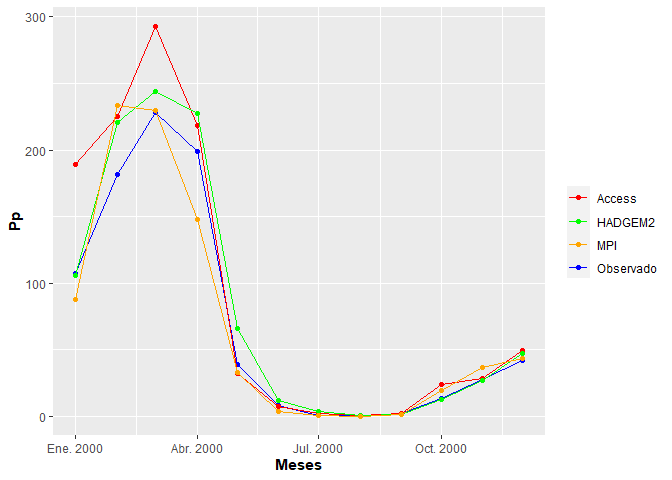

RESOLUCION
================
Grupo\_05
27/7/2021

**INTEGRANTES DEL GRUPO 05**

*BACA QUIÑONEZ, Pedro (17160038)*

*COSIOS LEONA, Jose (17160182)*

*ESQUIVEL GUILLERMO, Antoni (17160183)*

*GARRO DOROTEO, Jamir (17160185)*

*RIVERA REAÑO, Ricardo (17160037)*

**IMPORTANTE:** *Cargar las librerias*

``` r
library(tidyverse)
library(hydroGOF)
library(pacman)
```

## PARTE 1

**1) Se tiene una variable x (no necesariamente temperatura) que depende
de la elevación. Se sabe que entre los 1000 y 3000 metros, esta variable
se ve reducido en 2 unidades cada 500 metros. Entre los 3000 y
4000metros, varía en 0.5 unidades, y a una altitud mayor, su valor es
constante. Cree una función que permitaobtener el valor de esta
variable, ́unicamente con el dato de la elevación**

**El valor de la variable x a 1000 metros es de 81.4 unidades**

``` r
#Donde i es la altura
i <- 5000
y <- ((-0.004*i) + 85.4)
z <- ((-0.001*i) + 72.9)
m <- 72.4
if (1000 <= i & i <= 3000) {
 cat("El valor de la variable x es", y)
} else if (3000 < i & i <= 4000) {
  cat("El valor de la variable x es", z)
} else {
   cat("El valor de la variable x es", m)
}
```

    ## El valor de la variable x es 72.4

**2)Resolver el siguiente sistema de ecuaciones.**

``` r
(matriz<- matrix(c(3,2,-2,2,-1,3,1,4,2), nrow = 3 , byrow = T))
```

    ##      [,1] [,2] [,3]
    ## [1,]    3    2   -2
    ## [2,]    2   -1    3
    ## [3,]    1    4    2

``` r
 sol_matriz <- c(0,9,-4)
(solve(matriz,sol_matriz))
```

    ## [1]  2 -2  1

``` r
respuestas <- solve(matriz,sol_matriz)
names(respuestas) <- c("x","y","z")
respuestas
```

    ##  x  y  z 
    ##  2 -2  1

## PARTE 2

**Primero que nada leeremos la data**

``` r
parametros <- as_tibble(read.csv("mods_clima_uh.csv"))
```

**a) Calcular la precipitación acumulada anual (Valores observados) para
la cuenca asignada**

``` r
(cuenca_tumbes_obs <- parametros %>%
    dplyr::filter(uh_name == "Cuenca Tumbes" & bh_esc == "Observado" ) %>%
    group_by(uh_name) %>% 
    summarize( pp_acumulada = sum(bh_pc)))
```

    ## # A tibble: 1 x 2
    ##   uh_name       pp_acumulada
    ##   <chr>                <dbl>
    ## 1 Cuenca Tumbes         852.

**b) Calcular el porcentaje de sesgo (%, PBIAS) de los escenarios
climáticos (ACCESS, HADGEM2, MPI) respecto a los datos observados para
cada mes (enero - diciembre) de cada variable, para la cuenca asignada**

*Primero filtramos los datos y seleccionamos el parametro con el que
trabajaremos, el cual es la precipitación mensual (bh\_pc)*

``` r
ppobs <- dplyr::filter(parametros, bh_esc == "Observado" & 
                         uh_name == "Cuenca Tumbes") 
mod_Aces <- dplyr::filter(parametros, bh_esc == "ACCESS 1.0" &
                          uh_name == "Cuenca Tumbes") 
mod_Had <- dplyr::filter(parametros, bh_esc == "HadGEM2-ES" & 
                           uh_name == "Cuenca Tumbes") 
         
mod_MPI<- dplyr::filter(parametros, bh_esc == "MPI-ESM-LR" & 
                          uh_name == "Cuenca Tumbes") 
```

*Ahora aplicamos la función “pbias” el cual esta el la libreria
“hydroGOF” para tener los valores de sesgo y por ultimo unimos para que
no se repitan los valores*

*Aplicamos sesgo para la precipitacion*

``` r
(sesgo_pp <- parametros %>% 
  transmute(bias_Aces = pbias(mod_Aces$bh_pc, ppobs$bh_pc),
            bias_Had = pbias(mod_Had$bh_pc, ppobs$bh_pc),
            bias_MPI = pbias(mod_MPI$bh_pc, ppobs$bh_pc)) %>% unique())
```

    ## # A tibble: 1 x 3
    ##   bias_Aces bias_Had bias_MPI
    ##       <dbl>    <dbl>    <dbl>
    ## 1      25.9     13.8     -1.5

*Aplicamos sesgo para la evapotranspiracion real*

``` r
(sesgo_evap <- parametros %>% 
  transmute(bias_Aces = pbias(mod_Aces$bh_er, ppobs$bh_er),
            bias_Had = pbias(mod_Had$bh_er, ppobs$bh_er),
            bias_MPI = pbias(mod_MPI$bh_er, ppobs$bh_er)) %>% unique())
```

    ## # A tibble: 1 x 3
    ##   bias_Aces bias_Had bias_MPI
    ##       <dbl>    <dbl>    <dbl>
    ## 1       8.2      7.3        1

*Aplicamos sesgo para el rendimiento hídrico*

``` r
(sesgo_rhidrico <- parametros %>% 
  transmute(bias_Aces = pbias(mod_Aces$bh_rh, ppobs$bh_rh),
            bias_Had = pbias(mod_Had$bh_rh, ppobs$bh_rh),
            bias_MPI = pbias(mod_MPI$bh_rh, ppobs$bh_rh)) %>% unique())
```

    ## # A tibble: 1 x 3
    ##   bias_Aces bias_Had bias_MPI
    ##       <dbl>    <dbl>    <dbl>
    ## 1      35.9     17.4     -2.9

*Aplicamos sesgo para el caudal*

``` r
(sesgo_caudal <- parametros %>% 
  transmute(bias_Aces = pbias(mod_Aces$bh_qd, ppobs$bh_qd),
            bias_Had = pbias(mod_Had$bh_qd, ppobs$bh_qd),
            bias_MPI = pbias(mod_MPI$bh_qd, ppobs$bh_qd)) %>% unique())
```

    ## # A tibble: 1 x 3
    ##   bias_Aces bias_Had bias_MPI
    ##       <dbl>    <dbl>    <dbl>
    ## 1      40.9     21.3     -3.1

**c) De la pregunta anterior, ¿Cual es el escenario climático más
preciso? Fundamente su respuesta.**

``` r
as_tibble(sesgo_caudal, sesgo_evap, sesgo_pp, sesgo_rhidrico)
```

    ## # A tibble: 1 x 3
    ##   bias_Aces bias_Had bias_MPI
    ##       <dbl>    <dbl>    <dbl>
    ## 1      40.9     21.3     -3.1

**d) Graficar, con ggplot2, la precipitaci´on (enero a diciembre)
observada y modelos climaticos.**

``` r
(observado <- parametros %>% 
    dplyr::filter( uh_name == "Cuenca Tumbes" & bh_esc == "Observado") %>% 
  mutate( meses = as.Date(sprintf("2000-%s-01", bh_month)))%>% 
    dplyr::select(bh_pc,meses) %>% rename(ppobsr = bh_pc))
```

    ## # A tibble: 12 x 2
    ##     ppobsr meses     
    ##      <dbl> <date>    
    ##  1 108.    2000-01-01
    ##  2 182.    2000-02-01
    ##  3 228.    2000-03-01
    ##  4 199.    2000-04-01
    ##  5  39.0   2000-05-01
    ##  6   8.39  2000-06-01
    ##  7   1.11  2000-07-01
    ##  8   0.621 2000-08-01
    ##  9   2.07  2000-09-01
    ## 10  13.4   2000-10-01
    ## 11  28.1   2000-11-01
    ## 12  42.5   2000-12-01

``` r
(ACCESS <- parametros %>%
  dplyr::filter( uh_name == "Cuenca Tumbes" & bh_esc == "ACCESS 1.0" ) %>%
  dplyr::select(bh_pc) %>% rename(ppacces = bh_pc))
```

    ## # A tibble: 12 x 1
    ##    ppacces
    ##      <dbl>
    ##  1 189.   
    ##  2 225.   
    ##  3 293.   
    ##  4 218.   
    ##  5  32.2  
    ##  6   7.58 
    ##  7   2.68 
    ##  8   0.473
    ##  9   2.05 
    ## 10  24.0  
    ## 11  28.3  
    ## 12  49.9

``` r
(MPI <- parametros %>% 
  dplyr::filter( uh_name == "Cuenca Tumbes" & bh_esc == "MPI-ESM-LR" ) %>%
  dplyr::select(bh_pc) %>% rename(ppmpi = bh_pc))
```

    ## # A tibble: 12 x 1
    ##      ppmpi
    ##      <dbl>
    ##  1  88.2  
    ##  2 233.   
    ##  3 230.   
    ##  4 148.   
    ##  5  33.1  
    ##  6   4.08 
    ##  7   0.843
    ##  8   0.463
    ##  9   1.59 
    ## 10  19.3  
    ## 11  37.2  
    ## 12  43.4

``` r
(HadGEM2 <- parametros %>% 
  dplyr::filter( uh_name == "Cuenca Tumbes" & bh_esc == "HadGEM2-ES" ) %>%
  dplyr::select(bh_pc) %>% rename(pphad = bh_pc))
```

    ## # A tibble: 12 x 1
    ##      pphad
    ##      <dbl>
    ##  1 106.   
    ##  2 221.   
    ##  3 244.   
    ##  4 227.   
    ##  5  66.5  
    ##  6  11.8  
    ##  7   3.53 
    ##  8   0.834
    ##  9   1.82 
    ## 10  13.0  
    ## 11  26.8  
    ## 12  47.2

``` r
(observ_modelos <- data.frame(ACCESS, MPI ,HadGEM2,observado) %>% as_tibble())
```

    ## # A tibble: 12 x 5
    ##    ppacces   ppmpi   pphad  ppobsr meses     
    ##      <dbl>   <dbl>   <dbl>   <dbl> <date>    
    ##  1 189.     88.2   106.    108.    2000-01-01
    ##  2 225.    233.    221.    182.    2000-02-01
    ##  3 293.    230.    244.    228.    2000-03-01
    ##  4 218.    148.    227.    199.    2000-04-01
    ##  5  32.2    33.1    66.5    39.0   2000-05-01
    ##  6   7.58    4.08   11.8     8.39  2000-06-01
    ##  7   2.68    0.843   3.53    1.11  2000-07-01
    ##  8   0.473   0.463   0.834   0.621 2000-08-01
    ##  9   2.05    1.59    1.82    2.07  2000-09-01
    ## 10  24.0    19.3    13.0    13.4   2000-10-01
    ## 11  28.3    37.2    26.8    28.1   2000-11-01
    ## 12  49.9    43.4    47.2    42.5   2000-12-01

``` r
ggplot(observ_modelos, aes(x=meses)) +
  geom_line(aes(y=ppobsr, color = "Observado"))+
  geom_point(aes(y=ppobsr, color = "Observado"))+
  geom_line(aes(y=ppacces, color = "Access"))+
  geom_point(aes(y=ppacces, color = "Access"))+
  geom_line(aes(y=pphad, color = "HADGEM2"))+
  geom_point(aes(y=pphad, color = "HADGEM2"))+
  geom_line(aes(y=ppmpi, color = "MPI"))+
  geom_point(aes(y=ppmpi, color = "MPI"))+
  labs(x = "Meses",
       y = "Pp")+
  scale_colour_manual("",
                      breaks = c("Access","HADGEM2","MPI","Observado"),
                      values = c("red","green","orange","blue"))+
  theme(axis.title.x = element_text(face = "bold"),
        axis.title.y = element_text(face = "bold"))
```

<!-- -->

## PARTE 3

*Previamente se realizó la conversión de los valores de -99.9 a N.A*

``` r
head(datos_temperatura <- read_csv("temperatureDataset.csv") %>%
    dplyr::select(DATE,qc00000804) %>%
    mutate(DATE = as.Date (DATE,format = "%d/%m/%Y")) %>%
    rename(Temperaturas =qc00000804) %>%
    arrange(DATE) %>%
    mutate(Temperaturas = ifelse(Temperaturas == -99.9, NA, Temperaturas))
    ) 
```

    ## # A tibble: 6 x 2
    ##   DATE       Temperaturas
    ##   <date>            <dbl>
    ## 1 1928-11-02           NA
    ## 2 1928-11-03           NA
    ## 3 1928-11-04           NA
    ## 4 1928-11-05           NA
    ## 5 1928-11-06           NA
    ## 6 1928-11-07           NA

*Luego se verificó que el rango de datos esté completo*

``` r
seq(as.Date("1928-11-02"), as.Date("2015-10-31"), by = "day") %>%
  length()
```

    ## [1] 31775

``` r
tail(datos_temperatura)
```

    ## # A tibble: 6 x 2
    ##   DATE       Temperaturas
    ##   <date>            <dbl>
    ## 1 2015-10-26           NA
    ## 2 2015-10-27           NA
    ## 3 2015-10-28           NA
    ## 4 2015-10-29           NA
    ## 5 2015-10-30           NA
    ## 6 2015-10-31           NA

**a). Determine la cantidad de missing values para los años hidrológicos
Sep1983-Agos1984 y Sep1997-Agos1998.**

``` r
(missing_values1 <- 
   sum(is.na(dplyr::filter(datos_temperatura, DATE >= "1983-09-01" &
                             DATE <= "1984-08-31" )$Temperaturas)))
```

    ## [1] 0

``` r
(missing_value2 <- 
   sum(is.na(dplyr::filter(datos_temperatura, DATE >= "1997-09-01" &
                             DATE <= "1998-08-31" )$Temperaturas)))
```

    ## [1] 3

**b). Calcule la serie de tiempo de temperatura mensual (si el de días
con missing values, en un mes, supera el 5%, la temperatura mensual será
considerado como un NA). Además, identifique visualmente, posibles
valores atípicos y describa una posible causa**

``` r
(Temperatura_mensual <- 
  datos_temperatura %>%
  group_by(DATE = str_sub(DATE,1 , 7)) %>%
  mutate(
    missval = sum(is.na(Temperaturas))*100/n()
  ) %>%
  summarise(
    Temperaturas = mean(Temperaturas, na.rm = T),
    missval = unique(missval)
  )  %>%
  mutate(
    Temperaturas = ifelse(missval >= 5, NA, Temperaturas),
    DATE = as.Date(sprintf("%1$s-01",DATE)),
    month=str_sub(DATE,6,7)
  ))
```

    ## # A tibble: 1,044 x 4
    ##    DATE       Temperaturas missval month
    ##    <date>            <dbl>   <dbl> <chr>
    ##  1 1928-11-01           NA     100 11   
    ##  2 1928-12-01           NA     100 12   
    ##  3 1929-01-01           NA     100 01   
    ##  4 1929-02-01           NA     100 02   
    ##  5 1929-03-01           NA     100 03   
    ##  6 1929-04-01           NA     100 04   
    ##  7 1929-05-01           NA     100 05   
    ##  8 1929-06-01           NA     100 06   
    ##  9 1929-07-01           NA     100 07   
    ## 10 1929-08-01           NA     100 08   
    ## # ... with 1,034 more rows

**c). Determine la cantidad de missing values de la serie de tiempo a
paso mensual para los años 2005 y 2010.**

``` r
(NA_mensual1<- 
   sum(is.na(dplyr::filter(Temperatura_mensual, DATE >= "2005-01-01" & 
                             DATE <= "2005-12-01") $Temperaturas)))
```

    ## [1] 0

``` r
(NA_mensual2<- 
   sum(is.na(dplyr::filter(Temperatura_mensual, DATE >= "2006-01-01" & 
                             DATE <= "2006-12-01") $Temperaturas)))
```

    ## [1] 0

**d).Crea una funcion que calcule, a partir de los datos de temperatura
mensual, la climatologia(Ene-Dic). Obtener la climatologia para los
periodos 1980-1995 y 1996-2010. Plotear los resultados en una sola
grafica para describir sus diferencias y/o similitudes (entre
climatologias).**

*Definimos la funcion consulta\_t*

``` r
consulta_t <- function(x, y) {
  x <- as.character(x)
  y <- as.character(y)
  
Temperatura_mensual %>%
  filter(DATE >= x & DATE < y) %>%
  group_by(DATE = str_sub(DATE, 6, 7)) %>%
  summarise( 
    Temperaturas_prom = mean(Temperaturas, na.rm = T), 
  ) %>%
    mutate(periodo = sprintf("%1$s-%2$s", x = str_sub(x, 1, 4), y = str_sub(y, 1, 4)))
}
```

*Hallamos la climatologia para los peridos requeridos y nombramos los
tibbles*

``` r
consulta1 <- consulta_t("1980-01-01", "1995-12-31")
consulta2 <- consulta_t("1996-01-01", "2010-12-31")
```

*Agrupamos las variables*

``` r
periodo_total <- rbind(consulta1,consulta2)
```

*Ploteamos*

``` r
ggplot(periodo_total) +
  geom_bar(stat = "identity", fill = "#048ABF", aes(x = DATE, y = Temperaturas_prom)) +
  labs(y = "Temperatura", x = "meses") +
  facet_wrap(~periodo, nrow = 2) +
  scale_x_discrete(
    labels = month.abb)
```

<!-- -->

*Otra forma de ploteo para mejor visualizacion*

``` r
periodo_total %>%
  filter(periodo %in% c("1980-1995", "1996-2010")) %>%
  ggplot(aes(x=DATE, y=Temperaturas_prom, color=periodo))+
  geom_point()+
  theme_bw() +
  scale_x_discrete(
    labels = month.abb)+
  labs(y = "Temperatura promedio (°C)", x = "Tiempo (Meses)"
  )+
  ggtitle("Climatologia (Ene-Dic) para los periodos de 1980-1995 y 1996-2010")+
  theme(plot.title = element_text(vjust =2, hjust = 0.5))
```

<!-- -->

**e).Plotear (boxplot) la variabilidad de los valores mensuales
(Ene-Dic) para el perıodo 1980-2013 y describirlo correctamente**

*Filtramos para el periodo 1980-2013*

``` r
consulta3 <- Temperatura_mensual %>%
  rename(Temperatura_prom = Temperaturas) %>%
  dplyr::filter(DATE >= "1980-01-01" & DATE < "2013-12-31") 
```

*Ploteamos*

``` r
ggplot(consulta3, aes(month, Temperatura_prom)) +
  geom_boxplot(fill = "#048ABF") +
  theme_bw() +
  scale_x_discrete(
    labels = month.abb
  ) +
  ggtitle("Variabilidad de la temperatura mensual - periodo 1980-2013")+
  theme(plot.title = element_text(vjust =2, hjust = 0.5))+
  labs(y="Temperatura (°C)", x="tiempo (meses)") +
  theme(axis.title.y = element_text(vjust = 2.5))
```

<!-- -->
